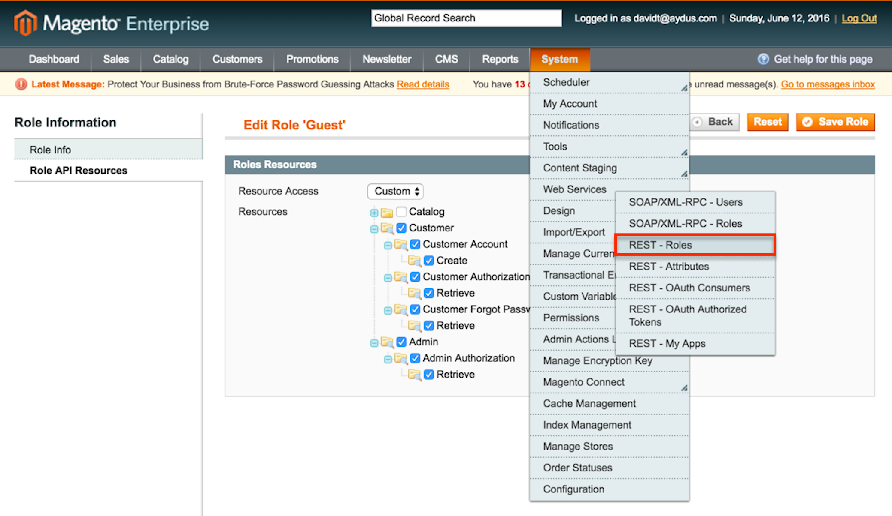
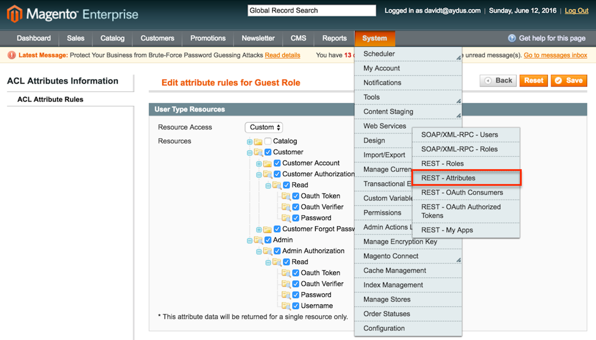
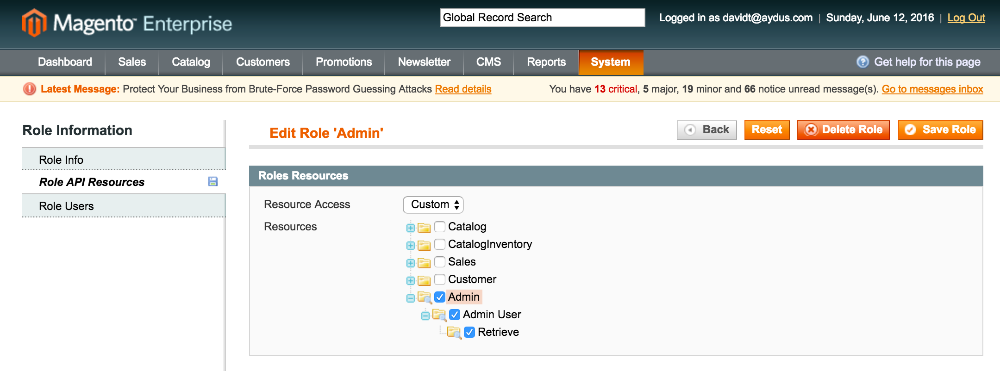
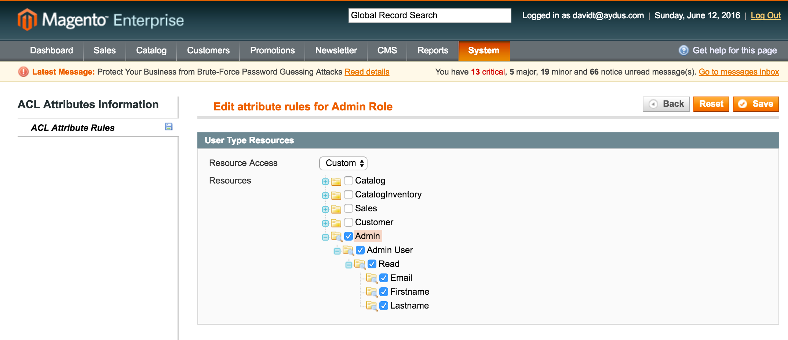

Restension
==========
Restension extends the Magento REST API. The primary feature is to be able to login/authorize
a customer or admin without requiring that the customer or admin go to your web page to 
authorize your app (Step 2 in the  OAuth 1 dance). 

Description
-----------
Adds additional features to the Magento REST API. Currently supports:

- Getting the Step 2 authorization code without displaying the authorization web page
- Register the customer
- Send forgot password email

How to use
-----------
Install the extension, either through Composer or Modman. Once installed, you need to enable 
guest role access to the newly added Customer and Admin resources:

Also, enable guest access to attributes so the guest REST user can access the resource attributes:

One Admin resource has been added, which once you're logged in as admin, you will be able to 
obtain your admin's email, firstname and lastname. If the Admin role does not exist, create it. 
Enable access to this admin role resource:

Enable access to the attributes of this resource:

Also make sure your admin has access to the REST admin role.

Support
-------
This is a free extension, as such no warranty or support is provided implied. However, you may 
contact us at <a href="https://www.extensions-store.com" target="_blank">https://www.extensions-store.com/contacts</a>.